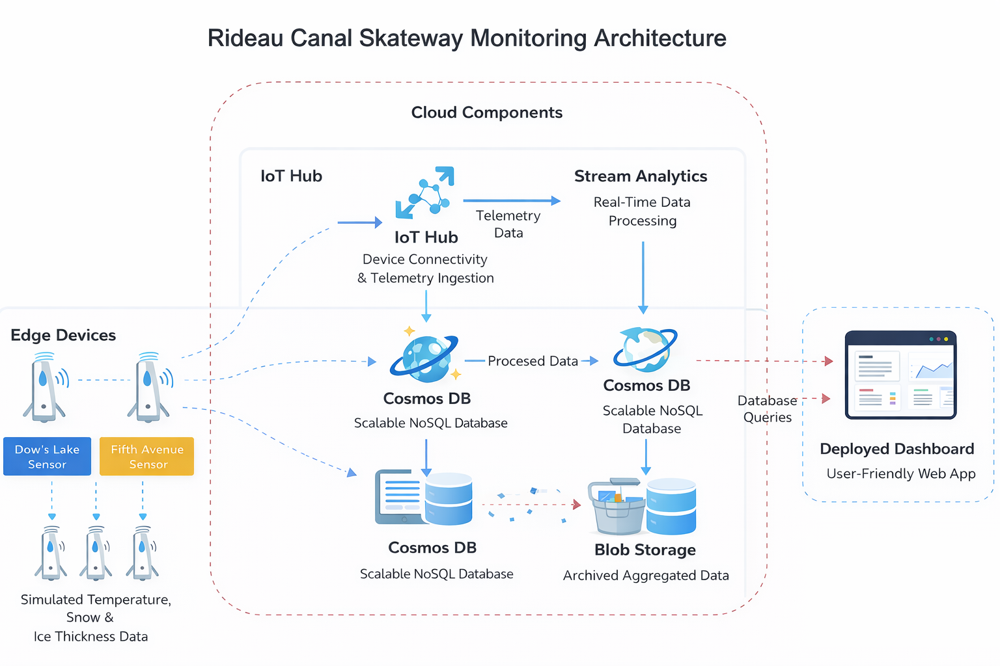
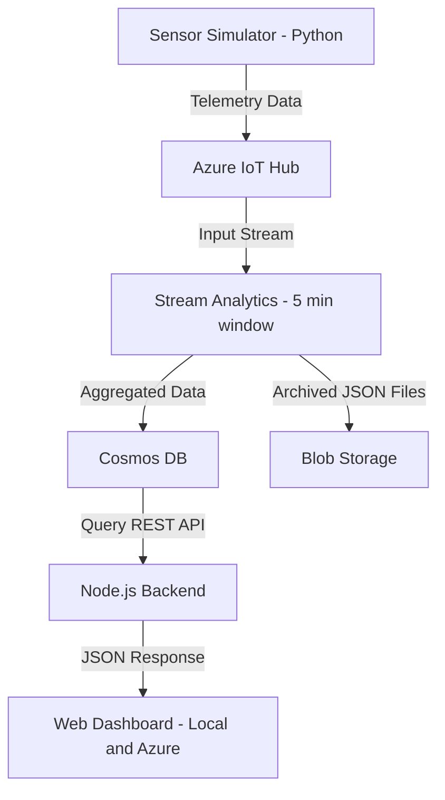

# CST8916: Final Project: Real-time Monitoring System for Rideau Canal Skateway

**Student Name**: Xinyi Zhao    
**Student ID**: 040953633    
**Course**: CST8916 Remote Data and Real-time Applications   
**Semester**: Winter 2026   

# Real-time Monitoring System for Rideau Canal Skateway

## Project Description
This project implements a real-time monitoring system for the Rideau Canal skating conditions using Microsoft Azure cloud services.
It simulates IoT sensor data, processes it in real time, and visualizes the results through an interactive web dashboard.

## Scenario Overview

### Problem Statement
Monitoring ice conditions across the Rideau Canal is critical for ensuring public safety. Traditional manual inspections are time-consuming and may not provide real-time updates.

### System Objectives
- Collect environmental data from multiple locations
- Process data in real time
- Provide safety indicators for skating conditions
- Visualize current and historical trends through a dashboard

## System Architecture
This section presents the overall architecture and data flow of the system, illustrating how real-time sensor data is processed and visualized using Azure services.  

### Architecture Diagram


### Data Flow Diagram


### Data Flow Explanation
The system begins with a Python-based sensor simulator that generates telemetry data.  
This data is transmitted to Azure IoT Hub for ingestion.   
Azure Stream Analytics processes the incoming data stream using tumbling windows to compute aggregated metrics.  
The processed results are stored in Cosmos DB for real-time querying and in Blob Storage for long-term archival.  
A Node.js backend retrieves the data and serves it to a web dashboard for visualization.

### Azure Services Used
- Azure IoT Hub – data ingestion
- Azure Stream Analytics – real-time processing
- Azure Cosmos DB – real-time data storage
- Azure Blob Storage – historical data archive
- Azure Web App Service – dashboard hosting

## Implementation Overview
### IoT Sensor Simulation
Simulates real-time environmental data and sends telemetry to IoT Hub.

### Azure IoT Hub
Configured with three devices representing different locations.
Used as the ingestion layer for streaming data.

### Stream Analytics Job
Processes incoming data and performs aggregation using a tumbling window.
**Query**
```sql
WITH AggregatedReadings AS
(
    SELECT
        [location],
        System.Timestamp AS windowEnd,
        AVG(CAST([iceThickness] AS float)) AS avgIceThickness,
        MIN(CAST([iceThickness] AS float)) AS minIceThickness,
        MAX(CAST([iceThickness] AS float)) AS maxIceThickness,
        AVG(CAST([surfaceTemperature] AS float)) AS avgSurfaceTemperature,
        MIN(CAST([surfaceTemperature] AS float)) AS minSurfaceTemperature,
        MAX(CAST([surfaceTemperature] AS float)) AS maxSurfaceTemperature,
        MAX(CAST([snowAccumulation] AS float)) AS maxSnowAccumulation,
        AVG(CAST([externalTemperature] AS float)) AS avgExternalTemperature,
        COUNT(*) AS readingCount
    FROM [iotinput] TIMESTAMP BY [timestamp]
    GROUP BY
        [location],
        TumblingWindow(minute, 5)
)

SELECT
    CONCAT([location], '-', CAST(windowEnd AS nvarchar(max))) AS id,
    [location],
    windowEnd,
    avgIceThickness,
    minIceThickness,
    maxIceThickness,
    avgSurfaceTemperature,
    minSurfaceTemperature,
    maxSurfaceTemperature,
    maxSnowAccumulation,
    avgExternalTemperature,
    readingCount,
    CASE
        WHEN avgIceThickness >= 30 AND avgSurfaceTemperature <= -2 THEN 'Safe'
        WHEN avgIceThickness >= 25 AND avgSurfaceTemperature <= 0 THEN 'Caution'
        ELSE 'Unsafe'
    END AS safetyStatus
INTO [cosmosoutput]
FROM AggregatedReadings;

SELECT
    CONCAT([location], '-', CAST(windowEnd AS nvarchar(max))) AS id,
    [location],
    windowEnd,
    avgIceThickness,
    minIceThickness,
    maxIceThickness,
    avgSurfaceTemperature,
    minSurfaceTemperature,
    maxSurfaceTemperature,
    maxSnowAccumulation,
    avgExternalTemperature,
    readingCount,
    CASE
        WHEN avgIceThickness >= 30 AND avgSurfaceTemperature <= -2 THEN 'Safe'
        WHEN avgIceThickness >= 25 AND avgSurfaceTemperature <= 0 THEN 'Caution'
        ELSE 'Unsafe'
    END AS safetyStatus
INTO [bloboutput]
FROM AggregatedReadings;
```

### Cosmos DB
Stores aggregated results for real-time querying by the dashboard.

### Blob Storage
Stores processed data as files for long-term archival and analysis.

### Web Dashboard
Displays real-time data, safety status, and historical trends.

### Azure Web App Service
Hosts the dashboard for public access.

## Repository Links
- Sensor Simulation: https://github.com/XinyiZhao-cloud/rideau-canal-sensor-simulation/
- Web Dashboard: https://github.com/XinyiZhao-cloud/rideau-canal-dashboard
- Live Deployment: https://cst8916-rideau-canal-dashboard-xyz-c7hab3gybsejh7cq.eastus2-01.azurewebsites.net
⚠️Note: _The live dashboard was deployed and demonstrated successfully. Resources were removed after testing to avoid unnecessary cloud costs._

## Video Demonstration
- YouTube (Unlisted): YOUR_VIDEO_LINK

## Setup Instructions
### Prerequisites
- Python 3.12 or 3.13
- Node.js
- Azure account

### High-level Steps
1.	Set up Azure IoT Hub and register devices
2.	Configure Stream Analytics job
3.	Deploy Cosmos DB and Blob Storage
4.	Run sensor simulator
5.	Start dashboard application
Detailed setup instructions are available in the individual repositories.
- Web Dashboard: https://github.com/XinyiZhao-cloud/rideau-canal-dashboard
- Sensor Simulation: https://github.com/XinyiZhao-cloud/rideau-canal-sensor-simulation/

## Results and Analysis

### Sample Outputs
- Real-time sensor data displayed on dashboard
- Aggregated metrics stored in Cosmos DB
- Historical data stored in Blob Storage

### Observations
- The system successfully processes streaming data in near real time
- Aggregation using tumbling windows provides stable insights
- Dashboard reflects safety conditions clearly across locations

## Challenges and Solutions

### Challenge 1: Azure deployment limitations

Some Azure services could not be deployed in the default region due to availability and quota restrictions, particularly when using an Azure for Students subscription.

**Solution:**  
Alternative regions were evaluated, and compatible regions were selected based on service availability. Resource configurations were also adjusted to fit within subscription limits. This ensured successful deployment while maintaining system functionality.

### Challenge 2: Data pipeline debugging

Ensuring consistent data flow across the pipeline—from IoT Hub to Stream Analytics and into storage services—was challenging. At times, no data appeared in Cosmos DB or Blob Storage due to configuration issues or inactive services.

**Solution:**  
Each component was validated independently. IoT Hub metrics were used to confirm message ingestion, Stream Analytics job status was checked to ensure it was running, and outputs were verified by inspecting Cosmos DB documents and Blob Storage files. This step-by-step debugging approach helped identify and resolve configuration issues efficiently.

### Challenge 3: GitHub security restrictions

During repository submission, pushes were blocked by GitHub due to the presence of sensitive information such as connection strings in committed files.

**Solution:**  
Sensitive data was removed from the repository and stored in environment variables using `.env` files. A `.env.example` file was created to provide configuration guidance without exposing secrets. Additionally, commit history was cleaned to remove previously committed credentials, ensuring compliance with GitHub security policies.

### Challenge 4: Unable to create Stream Analytics job via Azure Portal

During the implementation, creating the Stream Analytics job through the Azure Portal was not successful due to interface or configuration limitations.

**Solution:**  
The Stream Analytics job was created using the Azure Command Line Interface (CLI). After authenticating with `az login`, the required resources were provisioned and configured via command-line commands. This approach ensured successful deployment and provided greater control over the configuration process.

These challenges improved understanding of cloud deployment, debugging distributed systems, and secure configuration management.


## AI Tools Disclosure
- **Tool:** ChatGPT
- **Purpose:** Code generation, debugging errors, improving documentation and refine explanations
- All final implementation, configuration, and testing were completed and validated independently.

## References
- **Azure Stream Analytics Job Documentation**: https://learn.microsoft.com/en-us/azure/stream-analytics/quick-create-azure-cli
- **Azure IoT SDK**: https://learn.microsoft.com/en-us/azure/iot-hub/iot-sdks#device-sdks
- **Chart.js Documentation**: https://www.chartjs.org/
- **Node.js and Express Documentation**: https://expressjs.com/